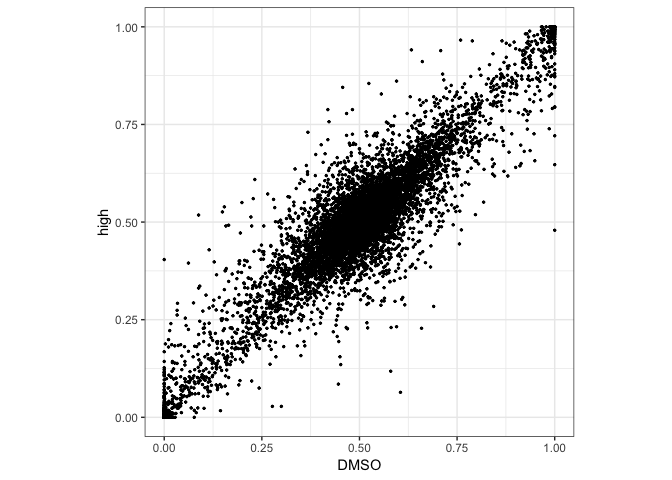

Allele-specific analysis of RNA-seq data using technical replicates
================

We start by loading the libraries and functions we will need:

5aza data
---------

To demonstrate how the pipeline works, we are going to use data from RNA-seq experiment aimed to study effect of 5aza treatment on expression and allele-specific expression. Let's look at the data first:

### Experiment design

5 samples of 4.11 Abelson clones:

| name    | description                   | number of repicates |
|---------|-------------------------------|---------------------|
| control | Untreated Day 0               | 2                   |
| DMSO    | DMSO control Day 2            | 2                   |
| low     | low 5aza treatment of 0.2 µM  | 2                   |
| medium  | medium 5aza treatment of 2 µM | 5                   |
| high    | high 5aza treatment of 10 µM  | 2                   |

The first step is to create design matrix describing the experiment:

``` r
experimentNames <- c("control","DMSO","low","medium","high")
techReps <- c(2,2,2,5,2)
designMatrix <- BuildDesign(experimentNames, techReps)
```

### Load the data

Now we can look at the data. Here is the *geneCountTab* dataframe with counts for all genes, all replicates and conditions:

``` r
inTabs <- "../../../data/5aza/pr_20180714_ISEKI_processed_gene_extended2.txt"
geneCountTab <- GetGatkPipelineTabs(inTabs, designMatrix$techReps, multiple = F)
head(geneCountTab)
```

    ##      ensembl_gene_id rep1_ref rep1_alt rep2_ref rep2_alt rep1_ref rep1_alt
    ## 1 ENSMUSG00000051951        0        0        0        0        0        0
    ## 2 ENSMUSG00000025900        1        0        0        0        0        0
    ## 3 ENSMUSG00000025902      109       36      145       65      128       68
    ## 4 ENSMUSG00000033845      418      314      423      353      303      245
    ## 5 ENSMUSG00000025903       84      137      103      136       56      133
    ## 6 ENSMUSG00000033813      718      951      809     1057      613      847
    ##   rep2_ref rep2_alt rep1_ref rep1_alt rep2_ref rep2_alt rep1_ref rep1_alt
    ## 1        0        0        0        0        0        0        0        0
    ## 2        2        0        0        0        0        0        0        0
    ## 3      171       84      216      151      103       39      228      109
    ## 4      367      264      346      257      152      141      214      198
    ## 5      112      168      126      135       35      102       72      112
    ## 6      672      934      573      773      254      317      369      447
    ##   rep2_ref rep2_alt rep3_ref rep3_alt rep4_ref rep4_alt rep5_ref rep5_alt
    ## 1        0        0        0        0        0        0        0        0
    ## 2        0        0        0        0        4        0        0        2
    ## 3      265      114      332      131      307      124      353      168
    ## 4      219      193      316      250      264      235      315      265
    ## 5      101      105      127      207      139      125      129      164
    ## 6      375      604      554      769      573      654      558      691
    ##   rep1_ref rep1_alt rep2_ref rep2_alt
    ## 1        1        0        0        0
    ## 2        0        0        1        4
    ## 3      426      176      383      144
    ## 4      328      258      295      232
    ## 5       93      181       90      133
    ## 6      466      646      471      566

### Look at AI correlations

We can calculate allelic imbalances for all genes for all experimental conditions pooling technical replicates:
$$AI=\\frac{maternal\\ counts}{maternal\\ counts + paternal\\ counts}$$

``` r
aiTable <- do.call(cbind, lapply(1:length(designMatrix$techReps), function(x){
      round(CountsToAI(geneCountTab, reps = unlist(designMatrix$replicateNums[x]),thr=10),3)
    }))
aiTable <- data.frame(geneCountTab$ensembl_gene_id, aiTable)
colnames(aiTable) <- c("ensembl_gene_id", designMatrix$experimentNames)
head(aiTable)
```

    ##      ensembl_gene_id control  DMSO   low medium  high
    ## 1 ENSMUSG00000051951      NA    NA    NA     NA    NA
    ## 2 ENSMUSG00000025900      NA    NA    NA     NA    NA
    ## 3 ENSMUSG00000025902   0.721 0.662 0.657  0.697 0.717
    ## 4 ENSMUSG00000033845   0.558 0.567 0.546  0.536 0.560
    ## 5 ENSMUSG00000025903   0.406 0.348 0.369  0.446 0.372
    ## 6 ENSMUSG00000033813   0.432 0.419 0.435  0.434 0.437

Let's visualize AI correlations, for example between AI estimates for DMSO (experiment 2) and high 5aza treatement(experiment 5):

``` r
ggplot(aiTable, aes_string(x=as.name(designMatrix$experimentNames[2]), y=as.name(designMatrix$experimentNames[5]))) +
  geom_point(size=0.5) +
  theme_bw() +
  coord_fixed() 
```



### Differential AI analysis

Let's compare conditions DMSO (experiment 2) and high 5aza treatment (experiment 5). We will construct 95%-CIs around AIs and get the resulting classification finding the genes demonstrating difference in AI between conditions (based on non-overlapping CIs).

First we get 95% CIs:

``` r
CIs_DMSO <- PerformCIAIAnalysis(geneCountTab, unlist(designMatrix$replicateNums[2]), Q=0.95, EPS=1.3, thr=NA, fullOUT=F)
CIs_high <- PerformCIAIAnalysis(geneCountTab, unlist(designMatrix$replicateNums[5]), Q=0.95, EPS=1.3, thr=NA, fullOUT=F)
CIs <- merge(CIs_DMSO[,c("ID", "meanAI", "pm")], CIs_high[,c("ID", "meanAI", "pm")], by="ID")
colnames(CIs) <- c("ID", "meanAI_DMSO", "pm_DMSO", "meanAI_high", "pm_high")
head(CIs)
```

    ##                   ID meanAI_DMSO    pm_DMSO meanAI_high    pm_high
    ## 1 ENSMUSG00000000001   0.5040816 0.01809528   0.5492424 0.01807642
    ## 2 ENSMUSG00000000003          NA         NA          NA         NA
    ## 3 ENSMUSG00000000028   0.4356061 0.05820896   0.6626984 0.07945403
    ## 4 ENSMUSG00000000031          NA         NA          NA         NA
    ## 5 ENSMUSG00000000037          NA         NA   0.2500000 0.22936402
    ## 6 ENSMUSG00000000049          NA         NA   0.7500000 0.22936402

Now let's run the differential analysis, using coverage threshold=40 and Bonferroni p-value correction:

``` r
thr=40
DiffAI_DMSO_high <- PerformDiffAIAnalysisFor2Conditions(geneCountTab, 
                                                          vect1CondReps = unlist(designMatrix$replicateNums[2]), 
                                                          vect2CondReps = unlist(designMatrix$replicateNums[5]), 
                                                          Q=0.95,
                                                          thr=thr, 
                                                        EPS=1.3, 
                                                        fullOUT=F
                                                        )
head(DiffAI_DMSO_high[,c("ID","diffAI")])
```

    ##                   ID diffAI
    ## 1 ENSMUSG00000051951     NA
    ## 2 ENSMUSG00000025900     NA
    ## 3 ENSMUSG00000025902   TRUE
    ## 4 ENSMUSG00000033845  FALSE
    ## 5 ENSMUSG00000025903  FALSE
    ## 6 ENSMUSG00000033813  FALSE

We will define a gene as demonstrating differential allelic imbalance between two conditions if this gene has non-intersecting CIs of allelic imbalance estimates in these conditions and if the difference between these allelic imbalance estimates is bigger than some cutoff (set to 0.2 here). The cutoff value is set arbitary depending on the biological question we are asking.

``` r
minDifference <- 0.2
GenesAIDiff <- DiffAI_DMSO_high[!is.na(DiffAI_DMSO_high$diffAI), ]
GenesAIDiff$deltaAI <- abs(GenesAIDiff$meanAI1 - GenesAIDiff$meanAI2)
GenesAIDiff <- GenesAIDiff[GenesAIDiff$diffAI==T & GenesAIDiff$deltaAI>=minDifference, ]
GenesAIDiff <- GenesAIDiff[order(GenesAIDiff$deltaAI, decreasing = T),]
head(GenesAIDiff[, c(1,4,10)])
```

    ##                       ID    meanAI1   meanAI2
    ## 10774 ENSMUSG00000027809 0.58033749 0.1177496
    ## 18387 ENSMUSG00000091345 0.08808406 0.5182222
    ## 15062 ENSMUSG00000034071 0.45666667 0.8447154
    ## 12337 ENSMUSG00000037443 0.42158067 0.7569024
    ## 15402 ENSMUSG00000050855 0.61622807 0.2875598
    ## 5295  ENSMUSG00000022156 0.75554622 0.4440580

``` r
print(paste0("Number of genes demonstrating differential allelic imbalance: ", length(GenesAIDiff$ID)))
```

    ## [1] "Number of genes demonstrating differential allelic imbalance: 53"
